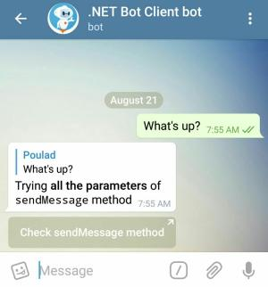

# Sending Messages

[](https://core.telegram.org/bots/api#sendmessage)
[](https://github.com/TelegramBots/Telegram.Bot/blob/master/test/Telegram.Bot.Tests.Integ/Sending%20Messages/TextMessageTests.cs)

There are many different types of message that a bot can send, but let's start with text messages.

## Basic text message

```csharp
await bot.SendMessage(chatId, "Hello, World!");
```


The `chatId` parameter would typically be the ID of a chat or a user that you obtained on a [received message](../../3/updates),
or it can be the @username of a public group/channel.

## Advanced text message

You can send messages with more characteristics:
- text effects _(using HTML, Markdown, or text entities)_
- attached inline buttons
- as a reply to a message
- and more...

> [!IMPORTANT]  
> We highly recommend you use HTML instead of Markdown because Markdown has lots of annoying aspects

The code snippet below sends a message using various parameters:

```csharp
var message = await bot.SendMessage(chatId, "Trying <b>all the parameters</b> of <code>sendMessage</code> method",
    ParseMode.Html,
    protectContent: true,
    replyParameters: update.Message.Id,
    replyMarkup: new InlineKeyboardButton("Check sendMessage method", "https://core.telegram.org/bots/api#sendmessage"));
```


Here `text` is written in [HTML format](https://core.telegram.org/bots/api#html-style) and `parseMode` indicates that.

By passing `protectContent` we prevent the message (and eventual media) to be copiable/forwardable elsewhere.

It's a good idea to make it clear to a user the reason why the bot is sending this message and that's why we pass the user's
message id for `replyParameters`.

You have the option of specifying a `replyMarkup` when sending messages.
Reply markups are explained in details later in this book.
Here we used an _Inline Keyboard Markup_ with a button that attaches to the message itself.
Clicking that opens [`sendMessage`](https://core.telegram.org/bots/api#sendmessage) method documentation in the browser.

## Observing the Message that just got sent

Almost all of the Send* methods return the message you just sent. Let's have a look at this object. Add this statement after the previous code.
```csharp
{{#include ../../../Examples/2/SendMessage.cs:message-contents}}
```

Output should look similar to this:
```text
Awesome bot sent message 123 to chat 123456789 at 8/21/18 11:25:09 AM. It is a reply to message 122 and has 2 message entities.
```
Try putting a breakpoint in the code to examine all the properties on a message objects you get.

There are a few things to note:
- `message.Date` is a timestamp in [UTC format](https://en.wikipedia.org/wiki/Coordinated_Universal_Time) (use `message.Date.ToLocalTime()` to convert to your local timezone).
- `message.Text`: plain text without effects
- `message.Entities`: list of [text effects](https://core.telegram.org/bots/api#messageentity) to be applied to the plain text
- `message.EntityValues`: text parts covered by these entities

You can use our extension methods `message.ToHtml()` or `message.ToMarkdown()` to convert the text & entities of a `Message` back into HTML **(recommended)** or Markdown.

## More message types

Discover more message types in the [next pages](media-msg.md).
