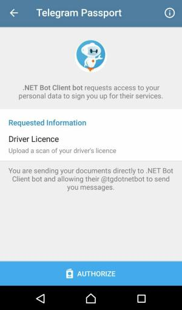
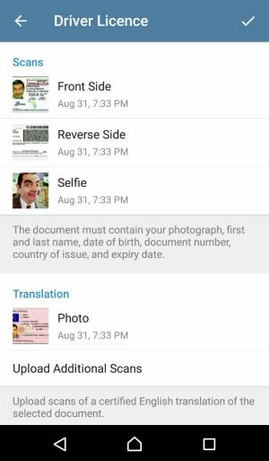

# Driver License Scope

[](https://github.com/TelegramBots/Telegram.Bot.Extensions.Passport/blob/master/test/IntegrationTests/Single%20Scope%20Requests/Driver%20License%20Tests.cs)

We use driver license scope here to show decryption of _ID document data_ and _passport files_ for front side scan,
reverse side scan, selfie photo, and translation scan.
That should cover most of the [field types in Telegram Passport].

Here are the steps:

1. [Authorization Request](#authorization-request)
1. [Driver License Info](#driver-license-info)
1. [Passport Message](#passport-message)
1. [Credentials](#credentials)
1. [ID Document Data](#id-document-data)
1. [Passport File](#passport-file)
    - [Front Side File](#front-side-file)
    - [Reverse Side File](#reverse-side-file)
    - [Selfie File](#selfie-file)
    - [Translation File](#translation-file)

## Authorization Request

[](https://core.telegram.org/passport#passportscope)
[](https://core.telegram.org/passport#passportscopeelementone)

[](https://github.com/TelegramBots/Telegram.Bot.Extensions.Passport/blob/master/test/IntegrationTests/Single%20Scope%20Requests/Driver%20License%20Tests.cs)

We start by generating authorization URI.
Since driver license is considered a proof of identity, we ask for optional data _selfie with document_ and
_translation document scan_ as well.


## Driver License Info

As a user, provide information for the required fields front side, reverse side, and document number.
Also, test methods here expect a selfie photo and a file for translation scan.





Click the _Authorize_ button at the end.

## Passport Message

[](https://core.telegram.org/bots/api#passportdata)

[](https://github.com/TelegramBots/Telegram.Bot.Extensions.Passport/blob/master/test/IntegrationTests/Single%20Scope%20Requests/Driver%20License%20Tests.cs)

This test method checks assumption for a passport message with driver license element on it.

## Credentials

[](https://core.telegram.org/bots/api#encryptedcredentials)
[](https://core.telegram.org/passport#credentials)

[](https://github.com/TelegramBots/Telegram.Bot.Extensions.Passport/blob/master/test/IntegrationTests/Single%20Scope%20Requests/Driver%20License%20Tests.cs)

We decrypt credentials using the RSA private key and verify that the same nonce is used.

```c#
RSA key = EncryptionKey.ReadAsRsa();
IDecrypter decrypter = new Decrypter();
Credentials credentials = decrypter.DecryptCredentials(
  key,
  passportData.Credentials
);
bool isSameNonce = credentials.Nonce == "Test nonce for driver license";
```

## ID Document Data

[](https://core.telegram.org/passport#iddocumentdata)

[](https://github.com/TelegramBots/Telegram.Bot.Extensions.Passport/blob/master/test/IntegrationTests/Single%20Scope%20Requests/Driver%20License%20Tests.cs)

In our test case, there is only 1 item in `message.passport_data.data` array and that's the encrypted element for
driver license scope.
We can get information such as document number and expiry date of driver license from element's `data` field.

```c#
IdDocumentData licenseDoc = decrypter.DecryptData<IdDocumentData>(
  encryptedData: element.Data,
  dataCredentials: credentials.SecureData.DriverLicense.Data
);
```

## Passport File

[](https://core.telegram.org/bots/api#passportfile)
[](https://core.telegram.org/passport#filecredentials)

Passport file is an encrypted JPEG file on Telegram servers.
You need to download the passport file and decrypt it using its accompanying _file credentials_ to see
the actual JPEG file content.
In this section we try to demonstrate different use cases that you might have for such files.

No matter the method used, the underlying decryption logic is the same.
It really comes down to your decision on working with _streams_ vs. _byte arrays_.
[IDecrypter] gives you both options.

### Front Side File

[](https://github.com/TelegramBots/Telegram.Bot.Extensions.Passport/blob/master/test/IntegrationTests/Single%20Scope%20Requests/Driver%20License%20Tests.cs)

A pretty handy extension method is used here to write the front side file to disk.
Method [DownloadAndDecryptPassportFileAsync] does a few things:

1. Makes a HTTP request to fetch encrypted file info using _passport file\_id_
1. Makes a HTTP request to download the encrypted file using its _file\_path_
1. Decrypts the encrypted file
1. Writes the actual content to destination stream

```c#
File encryptedFileInfo;
using (System.IO.Stream stream = System.IO.File.OpenWrite("/path/to/front-side.jpg"))
{
  encryptedFileInfo = await BotClient.DownloadAndDecryptPassportFileAsync(
    element.FrontSide, // PassportFile object for front side
    credentials.SecureData.DriverLicense.FrontSide, // front side FileCredentials
    stream // destination stream for writing to JPEG content to
  );
}
```

> **Warning**: This method is convenient to use but gives you the least amount of control over the operations.

### Reverse Side File

[](https://github.com/TelegramBots/Telegram.Bot.Extensions.Passport/blob/master/test/IntegrationTests/Single%20Scope%20Requests/Driver%20License%20Tests.cs)

We broke the previous method call into two operations here for reverse side of the driver license.

```c#
File encryptedFileInfo;
using (System.IO.Stream
  encryptedContent = new System.IO.MemoryStream(element.ReverseSide.FileSize),
  decryptedFile = System.IO.File.OpenWrite("/path/to/reverse-side.jpg")
) {
  // fetch encrypted file info and download it to memory
  encryptedFileInfo = await BotClient.GetInfoAndDownloadFileAsync(
    element.ReverseSide.FileId, // file_id of passport file for reverse side
    encryptedContent // stream to copy the encrypted file into
  );

  // decrypt the file and write it to disk
  await decrypter.DecryptFileAsync(
    encryptedContent,
    credentials.SecureData.DriverLicense.ReverseSide, // reverse side FileCredentials
    decryptedFile // stream to write photo file into
  );
}
```

### Selfie File

[](https://github.com/TelegramBots/Telegram.Bot.Extensions.Passport/blob/master/test/IntegrationTests/Single%20Scope%20Requests/Driver%20License%20Tests.cs)

We deal with selfie photo as a byte array.
This is essentially the same operation as done above via streams.
We also post the selfie photo to a chat.

```c#
// fetch passport file info on Telegram servers
File encryptedFileInfo = await BotClient.GetFileAsync(element.Selfie.FileId);

// download encrypted file and get its bytes
byte[] encryptedContent = await BotClient.DownloadFileBytesAsync(encryptedFileInfo);

// decrypt the content and get bytes of the actual selfie photo
byte[] selfieContent = decrypter.DecryptFile(
  encryptedContent,
  credentials.SecureData.DriverLicense.Selfie
);

// send the photo to a chat
await BotClient.SendPhotoAsync(
  123456,
  selfieContent,
  "selfie with driver license"
);
```

### Translation File

[](https://github.com/TelegramBots/Telegram.Bot.Extensions.Passport/blob/master/test/IntegrationTests/Single%20Scope%20Requests/Driver%20License%20Tests.cs)

A bot can request for certified English translations of a document.
Translations are also encrypted passport files so their decryption is no different than others passport files.

Assuming that user sends one translation scan for driver license, we receive the translation passport file object in
`message.passport_data.data[0].translation[0]` and its accompanying file credentials object in
`credentials.secure_data.driver_license.translation[0]`.

File gets written to disk as a byte array.

```c#
PassportFile passportFile = element.Translation[0];
FileCredentials fileCreds = credentials.SecureData.DriverLicense.Translation[0];

// fetch passport file info
File encryptedFileInfo = await BotClient.GetFileAsync(passportFile.FileId);

// download encrypted file and get its bytes
byte[] encryptedContent = await BotClient.DownloadFileBytesAsync(encryptedFileInfo);

// decrypt the content and get bytes of the actual selfie photo
byte[] content = decrypter.DecryptFile(
  encryptedContent,
  fileCreds
);

// write file to disk
await System.IO.File.WriteAllBytesAsync("/path/to/translation.jpg", content);
```

[field types in Telegram Passport]: https://core.telegram.org/passport#fields
[IDecrypter]: https://github.com/TelegramBots/Telegram.Bot.Extensions.Passport/blob/master/src/Telegram.Bot.Extensions.Passport/Decryption/IDecrypter.cs
[DownloadAndDecryptPassportFileAsync]: https://github.com/TelegramBots/Telegram.Bot.Extensions.Passport/blob/master/src/Telegram.Bot.Extensions.Passport/TelegramBotClientExtensions.cs
