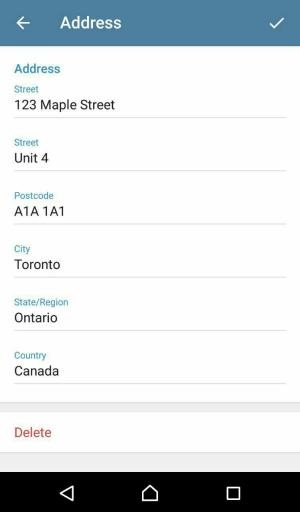

# Telegram Passport - Quickstart

[](https://github.com/TelegramBots/Telegram.Bot.Extensions.Passport/tree/master/src/Quickstart/Program.cs)

This guide shows you very briefly how Telegram Passport works.
See the complete version of the code at [Quickstart project].

## Encryption Keys

You don't really need to generate any RSA key. Use our sample keys for this demo.
Send the public key to [@BotFather] using `/setpublickey` command:


Copy this public key and send it to BotFather.

```text
-----BEGIN PUBLIC KEY-----
MIIBIjANBgkqhkiG9w0BAQEFAAOCAQ8AMIIBCgKCAQEA0VElWoQA2SK1csG2/sY/
wlssO1bjXRx+t+JlIgS6jLPCefyCAcZBv7ElcSPJQIPEXNwN2XdnTc2wEIjZ8bTg
BlBqXppj471bJeX8Mi2uAxAqOUDuvGuqth+mq7DMqol3MNH5P9FO6li7nZxI1FX3
9u2r/4H4PXRiWx13gsVQRL6Clq2jcXFHc9CvNaCQEJX95jgQFAybal216EwlnnVV
giT/TNsfFjW41XJZsHUny9k+dAfyPzqAk54cgrvjgAHJayDWjapq90Fm/+e/DVQ6
BHGkV0POQMkkBrvvhAIQu222j+03frm9b2yZrhX/qS01lyjW4VaQytGV0wlewV6B
FwIDAQAB
-----END PUBLIC KEY-----
```

Now Telegram client app can encrypt the data for your bot using this key.

## Request Information

Bot waits for a text message from user. Once it receives a text message, it generates an authorization request link
and sends that to the user.

### Authorization Request

[](https://core.telegram.org/passport#request-parameters)

A passport authorization request means that bot should ask user to open a
`tg://resolve` URI in the browser with specific parameters in its query string.

This [AuthorizationRequest] type helps you in creating such an URI.

```c#
AuthorizationRequest authReq = new AuthorizationRequest(
  botId: 123456, // bot user ID
  publicKey: "...", // public key in PEM format. same as the key above.
  nonce: "unique nonce for this request",
  scope: ... // a PassportScope object
);
```

In [SendAuthorizationRequestAsync] method, we ask for `address` and `phone_number` scopes.
Then, we generate query string and ask user to open the link.

You might be wondering what is the magic in here?

[https://telegrambots.github.io/Telegram.Bot.Extensions.Passport/redirect.html](https://telegrambots.github.io/Telegram.Bot.Extensions.Passport/redirect.html)

This web page redirects user to `tg://resolve` URI appending whatever query string was passed to it.

> If user is on an Android device, URI will start with [tg:] instead of default `tg://`.


### Passport Data

You, the user, should now be redirected to Telegram Passport screen in Telegram client app.
Enter your password and log in.

> Note that app will ask you to register if this is the first time you are using Telegram Passport.


Fill in the _address_ and _phone number_ data. Click on _Authorize_ button at the end.





Telegram client app encrypts the data using bot's public key and sends the encrypted data to Telegram servers.

### Data Decryption

[](https://core.telegram.org/bots/api#passportdata)

Bot now receives a new update with those encrypted passport data. User also is notified in the chat:


Let's decrypt that gibberish to get the information. That's what [DecryptPassportDataAsync] method does.

#### Step 1: Credentials

[](https://core.telegram.org/bots/api#encryptedcredentials)
[](https://core.telegram.org/passport#credentials)

You can't just access the encrypted data in `message.passport_data.data` array.
Required parameters for their decryption is in `message.passport_data.credentials` object.
But that credentials object is encrypted itself using bot's public key!

So we take bot's _private key_ this time and decrypt credentials.

> There are more details about importing a key in PEM format on [RSA Key page].

```c#
IDecrypter decrypter = new Decrypter(GetRsaPrivateKey());
Credentials credentials = decrypter.DecryptCredentials(
  message.PassportData.Credentials // EncryptedCredentials object
);
```

#### Step 2: Nonce

[](https://core.telegram.org/passport#credentials)
[](https://core.telegram.org/passport#request-parameters)

There is a `nonce` property on credentials (now decrypted) object.
In order to prevent certain attacks, ensure its value is exactly the same as nonce in authorization request.
Read more about [nonce on Wikipedia].

#### Step 3: Residential Address

[](https://core.telegram.org/bots/api#encryptedpassportelement)
[](https://core.telegram.org/passport#residentialaddress)

[](https://core.telegram.org/passport#securedata)
[](https://core.telegram.org/passport#securevalue)
[](https://core.telegram.org/passport#datacredentials)

It's finally time to see user's address.
We are looking for an encrypted element with type of _address_ in `message.passport_data.data` array.
Also, decryption parameters for that are in `credentials.secure_data.address.data`.
Here is how the decryption magic happens:

```c#
EncryptedPassportElement addressElement = message.PassportData.Data.Single(
  el => el.Type == PassportEnums.Scope.Address
);
ResidentialAddress address = decrypter.DecryptData<ResidentialAddress>(
  encryptedData: addressElement.Data,
  dataCredentials: credentials.SecureData.Address.Data
);
```

[DecryptData] method does 3 tasks here:

1. Decrypts data into a JSON-serialized string
1. Verifies data hashes match
1. Converts from JSON to .NET object

#### Step 4: Phone Number

[](https://core.telegram.org/bots/api#encryptedpassportelement)

Values for phone number and email address are not end-to-end encrypted in Telegram Passport.
So there is no need for decryption at this point.
Just find the element with type of _phone__number_ in `message.passport_data.data` array.

### Information Demo

At the end, bot sends some of the information received to the user for demo purposes.


<!-- ----------- -->

[Quickstart project]: https://github.com/TelegramBots/Telegram.Bot.Extensions.Passport/tree/master/src/Quickstart
[@BotFather]: https://t.me/BotFather
[AuthorizationRequest]: https://github.com/TelegramBots/Telegram.Bot.Extensions.Passport/blob/gh-pages/redirect.html
[SendAuthorizationRequestAsync]: https://github.com/TelegramBots/Telegram.Bot.Extensions.Passport/blob/gh-pages/redirect.html
[tg:]: https://github.com/TelegramBots/Telegram.Bot.Extensions.Passport/blob/gh-pages/redirect.html
[DecryptPassportDataAsync]: https://github.com/TelegramBots/Telegram.Bot.Extensions.Passport/blob/gh-pages/redirect.html
[RSA Key page]: key.md
[nonce on Wikipedia]: https://en.wikipedia.org/wiki/Cryptographic_nonce
[DecryptData]: https://github.com/TelegramBots/Telegram.Bot.Extensions.Passport/blob/master/src/Telegram.Bot.Extensions.Passport/Decryption/IDecrypter.cs#